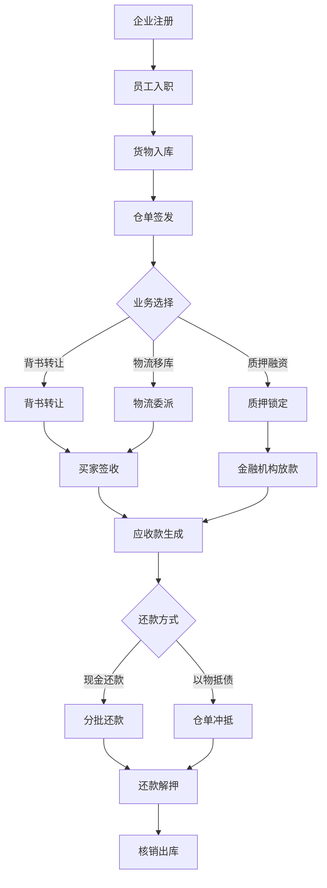
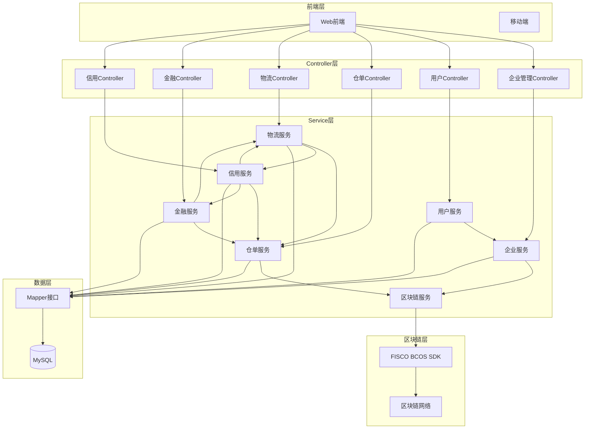
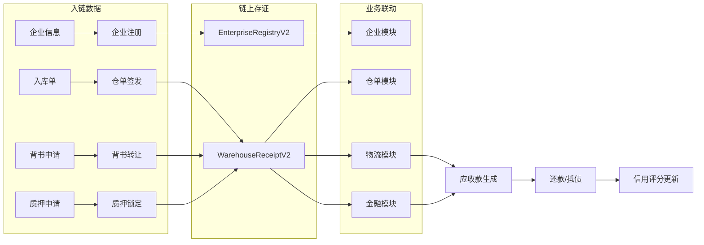

# 供应链金融系统项目架构说明文档

## 一、文档概述

本文档基于docs目录下各模块设计说明文档整合而成，旨在全面阐述供应链金融系统的项目架构全貌。

### 1.1 文档目的

为开发团队提供统一、准确的架构参考，确保模块设计与实现的一致性。

### 1.2 项目核心目标

构建一个基于FISCO BCOS区块链的供应链金融平台，实现：

- 仓单资产的数字化确权、质押、拆分与背书流转
- 物流位移过程的实时追踪与存证
- 信用评估的动态积分与差异化服务
- 应收款项的生成、调整与闭环清算

---

## 二、项目整体架构

### 2.1 架构设计理念

本项目采用**垂直分层架构（Vertical Slice Architecture）**，以业务模块为核心进行代码组织，实现模块间的高内聚、低耦合，便于后期向微服务架构演进。

### 2.2 整体分层

```
┌─────────────────────────────────────────────────────────────┐
│                    表现层 (Controller)                       │
│  企业控制器 | 用户控制器 | 仓单控制器 | 物流控制器 | 金融控制器 | 信用控制器 │
├─────────────────────────────────────────────────────────────┤
│                    服务层 (Service)                          │
│  企业服务 | 用户服务 | 仓单服务 | 物流服务 | 金融服务 | 信用服务 | 区块链服务 │
├─────────────────────────────────────────────────────────────┤
│                    数据访问层 (Mapper)                       │
│  各模块Mapper接口                                            │
├─────────────────────────────────────────────────────────────┤
│                    基础设施层                                │
│  FISCO BCOS SDK | MySQL | Redis                            │
└─────────────────────────────────────────────────────────────┘
```

### 2.3 核心设计原则

1. **RBAC + ABAC权限模型**：基于角色的访问控制结合属性约束
2. **链上链下协同**：数据库事务与区块链交互保证最终一致性
3. **JWT无状态认证**：双令牌策略支持高性能并发处理
4. **模块解耦**：各业务模块独立演进，通过事件或接口交互

---

## 三、模块详细设计

### 3.1 企业管理模块

#### 3.1.1 模块功能

负责企业实体的全生命周期管理，包括：

- 企业注册与区块链身份生成
- 企业登录与JWT令牌颁发
- 注销流程管理
- 员工邀请码生成与管理

#### 3.1.2 核心接口

| 接口名称 | 路径 | 说明 |
|---------|------|------|
| 企业注册 | POST /ent/register | 生成雪花ID、调用SDK生成区块链地址与私钥 |
| 企业登录 | POST /ent/login | 校验成功后颁发JWT |
| 发起注销 | POST /ent/cancellation/apply | 校验链上资产余额是否清零 |
| 修改登录密码 | PUT /ent/password/login | 从JWT解析entId |
| 获取企业详情 | GET /ent/info_detail | 返回基础资料、角色、状态及区块链地址 |
| 生成邀请码 | GET /ent/invite-codes | 用于用户注册时绑定企业 |
| 员工列表 | GET /ent/info_user | 分页查询关联该企业的用户 |

#### 3.1.3 数据字典

| 字段名 | 类型 | 说明 |
|--------|------|------|
| ent_id | Long | 全局唯一标识，雪花算法生成 |
| enterprise_name | String | 企业法定全称 |
| org_code | String | 统一社会信用代码 |
| blockchain_address | String | 区块链公开地址 |
| ent_role | Integer | 业务角色：1-核心企业、2-现货交易平台、3-供应商、6-金融机构、9-仓储方、12-物流方 |

#### 3.1.4 依赖关系

- 依赖FISCO BCOS SDK生成区块链地址与私钥
- 依赖用户模块（员工隶属于企业）

---

### 3.2 用户（员工）模块

#### 3.2.1 模块功能

负责企业员工账号管理：

- 员工注册（通过邀请码绑定企业）
- 登录认证与JWT颁发
- 个人信息管理
- 企业内权限管理

#### 3.2.2 核心接口

| 接口名称 | 路径 | 说明 |
|---------|------|------|
| 员工注册 | POST /user/register | 校验邀请码，提取enterpriseId |
| 员工登录 | POST /user/login | 颁发JWT含userId,entId,userRole |
| 获取个人资料 | GET /user/profile | 从JWT解析userId |
| 修改个人信息 | PUT /user/update | 仅允许非敏感字段 |
| 发起注销申请 | POST /user/cancel/apply | 校验是否有未处理审批任务 |
| 分配员工角色 | PUT /user/assign_role | 校验当前登录者必须是该企业管理员 |

#### 3.2.3 角色定义

| 角色编码 | 说明 |
|---------|------|
| ADMIN | 管理员 |
| FINANCE | 财务 |
| OPERATOR | 业务员 |

#### 3.2.4 依赖关系

- 依赖企业管理模块（邀请码关联企业）
- JWT载荷包含entId，实现与企业模块的关联

---

### 3.3 仓单模块（Warehouse）

#### 3.3.1 模块定位

负责物流金融中"物"的数字化转换。通过将物理库存映射为链上电子仓单，实现货权的**确权、质押、拆分与背书流转**，为融资模块提供底层资产支撑。

#### 3.3.2 核心业务逻辑

- **签发（Mint）**：仓储方根据入库实物信息，在链上铸造唯一数字凭证
- **背书转让（Endorsement）**：通过"发起背书+对方签收"的闭环流程转移货权
- **拆分与合并（Split & Merge）**：支持资产灵活重组，拆分需满足"重量守恒"原则
- **质押与解押（Lock & Unlock）**：由金融机构发起，冻结资产流转权限
- **核销（Burn）**：提货出库后，仓单生命周期结束

#### 3.3.3 核心接口

| 接口名称 | 路径 | 说明 |
|---------|------|------|
| 入库单申请 | POST /stock/in/apply | 企业发起，创建StockOrder记录 |
| 仓单签发 | POST /receipt/mint | 仓储方基于入库单铸造Token |
| 发起背书转让 | POST /endorse/launch | 校验is_locked=false |
| 背书签收确认 | PUT /endorse/confirm | 链上转移货权，更新owner_ent_id |
| 发起拆分申请 | POST /receipt/split/apply | 校验总重量平衡 |
| 执行拆分/合并 | POST /receipt/op/execute | 仓储方操作，链上销毁与重铸 |
| 质押锁定 | PATCH /receipt/lock | 金融机构操作，更新is_locked=true |
| 还款解押 | PATCH /receipt/unlock | 金融机构操作，恢复is_locked=false |
| 申请核销出库 | POST /receipt/burn/apply | 持有人发起 |
| 核销终审 | PUT /receipt/burn/confirm | 仓储方审核执行Burn |
| 全路径溯源查询 | GET /trace/receipt/{id} | 递归查询parent_id链条 |

#### 3.3.4 操作权限矩阵

| 业务动作 | 仓储方 | 企业 | 金融机构 |
|---------|-------|------|---------|
| 仓单签发 | 发起 | - | - |
| 拆分/合并 | 操作 | 发起 | - |
| 背书转让 | - | 发起/接收 | - |
| 质押锁定 | - | - | 操作 |
| 核销出库 | 审核 | 发起 | - |

#### 3.3.5 依赖关系

- 依赖仓储企业（warehouse_ent_id）
- 依赖区块链服务（WarehouseReceiptV2合约）

---

### 3.4 物流模块（Logistics）

#### 3.4.1 模块定位

负责货物物理位移的数字化映射与风控核心。通过电子提货委派单（DPDO）建立货主、物流方与仓库之间的授权链条。

#### 3.4.2 核心业务逻辑

支持三种核心场景：

1. **直接移库**：货主不换，从仓库A搬到仓库B
2. **转让后移库**：货主A卖给买家B，B要求换仓库
3. **发往指定仓库**：企业发货入库，生成新仓单

#### 3.4.3 核心接口

| 接口名称 | 路径 | 说明 |
|---------|------|------|
| 创建物流委派单 | POST /logistics/create | 锁定仓单对应数量 |
| 物流指派任务 | POST /logistics/assign | 绑定司机身份与车牌 |
| 仓库提货确认 | POST /logistics/pickup | 核销原仓单重量 |
| 到货入库申请 | POST /logistics/arrive | 生成新仓单或增量入库 |
| 物流状态追踪 | GET /logistics/track | 全流程监控 |

#### 3.4.4 业务场景说明

| 场景 | 触发条件 | 仓单操作 |
|------|---------|---------|
| 直接移库 | 货主指定目标仓库和物流公司 | 在目标仓库生成新仓单 |
| 转让后移库 | 完成背书转让后，新买家下达指令 | 为新买家生成新仓单 |
| 发往指定仓库 | 企业发货到监管仓库 | 实时生成数字仓单 |

#### 3.4.5 依赖关系

- 依赖仓单模块（生成新仓单、锁定重量）
- 依赖信用模块（信用额度校验）

---

### 3.5 金融模块（Financial Module）

#### 3.5.1 模块定位

物流金融系统的价值核心。负责将"仓单资产"和"物流位移"转化为"数字债权"，即记录并管理应收款项。

#### 3.5.2 核心业务逻辑

**第一阶段：应收款生成（资产证券化）**

- 新货入库场景：货物入监管仓产生新仓单时，系统自动关联预设单价生成应收款
- 转让配送场景：买方点击签收确认后，自动转化为针对买方的贸易应收款

**第二阶段：金额动态调整**

- 部分提取与拆分：按比例切分应收款
- 物流损耗处理：根据实收数据调减应收款总额

**第三阶段：还款与核销**

- 分批偿还：每还一笔自动更新剩余欠款
- 以物抵债：仓单所有权转让给债权人，冲销债务

#### 3.5.3 核心接口

| 接口名称 | 路径 | 说明 |
|---------|------|------|
| 应收款预生成 | POST /finance/receivable/generate | 物流送达时自动调用 |
| 账单确权确认 | POST /finance/receivable/confirm | 债务人数字签名确认 |
| 金额动态修正 | PATCH /finance/receivable/adjust | 处理损耗或拆分 |
| 现金分批还款 | POST /finance/repay/cash | 部分还款记录 |
| 仓单抵债核销 | POST /finance/repay/offset | 以物抵债 |

#### 3.5.4 数据字典

| 字段名 | 类型 | 说明 |
|--------|------|------|
| receivable_no | String | 账单编号 |
| creditor_ent_id | Long | 债权人ID |
| debtor_ent_id | Long | 债务人ID |
| initial_amount | Decimal | 原始金额 |
| adjusted_amount | Decimal | 结算金额 |
| balance_unpaid | Decimal | 待还余额 |
| status | Integer | 账款状态：1-待确认、2-生效中、3-部分还款、4-已结清、5-逾期 |

#### 3.5.5 依赖关系

- 依赖仓单模块（仓单抵债时变更owner）
- 依赖物流模块（生成应收款的源头）

---

### 3.6 信用管理模块

#### 3.6.1 模块定位

动态积分系统，通过采集仓单、物流、金融三个模块的底层行为自动计算信用分。

#### 3.6.2 核心逻辑

**信用加分（合规奖励）**：准时还款、货物无损达、入库量稳定

**信用扣分（违约惩罚）**：逾期还款、物流路径严重偏移、仓单数据异常、频繁撤单

**等级应用（差异化服务）**：

- 高信用（AAA）：质押率90%、低物流监控频率
- 低信用（C/D）：质押率50%、强制要求司机开启摄像头

#### 3.6.3 核心接口

| 接口名称 | 路径 | 说明 |
|---------|------|------|
| 获取信用画像 | GET /credit/profile/{ent_id} | 查看信用分、等级、额度 |
| 违约事件上报 | POST /credit/event/report | 金融/风控触发扣分 |
| 信用等级重算 | PATCH /credit/reevaluate | 每月自动更新 |
| 额度实时锁死 | POST /credit/limit/lock | 超额度时拦截物流单 |

#### 3.6.4 信用档案

| 字段名 | 类型 | 说明 |
|--------|------|------|
| credit_score | Integer | 信用评分（300-1000） |
| credit_level | String | 信用等级：AAA/AA/A/B/C/D |
| available_limit | Decimal | 授信额度 |
| used_limit | Decimal | 已用额度 |

#### 3.6.5 联动机制

| 场景 | 高信用(AAA/AA) | 低信用(C/D) |
|------|---------------|-------------|
| 仓单拆分 | 自助办理 | 需人工审核 |
| 物流监控 | 扫码即可 | 需照片+GPS |
| 质押率 | 最高90% | 最高50% |

#### 3.6.6 依赖关系

- 依赖仓单模块（履约数据）
- 依赖物流模块（偏航数据）
- 依赖金融模块（还款数据）

---

## 四、模块间交互

### 4.1 模块依赖关系图

```
                    ┌─────────────────┐
                    │   企业管理模块   │
                    └────────┬────────┘
                             │ 依赖
                             ▼
┌──────────────┐    ┌─────────────────┐    ┌─────────────────┐
│  信用管理模块 │◄───│   用户模块      │    │   仓单模块      │
└───────┬───────┘    └─────────────────┘    └────────┬────────┘
        │                                                │
        │ 依赖                                          │ 依赖
        ▼                                                ▼
┌───────────────┐                              ┌─────────────────┐
│  金融模块     │─────────────────────────────│   物流模块      │
└───────────────┘                              └─────────────────┘
```

### 4.2 数据流向

#### 4.2.1 仓单生命周期

```
企业注册 → 仓储入库 → 仓单签发 → (背书转让/拆分合并) → 质押融资 → 还款解押 → 核销出库
```

#### 4.2.2 物流追踪

```
物流创建 → 提货确认 → 在途运输 → 到货入库 → (生成新仓单/增量入库)
```

#### 4.2.3 应收款流转

```
物流送达 → 应收款生成 → 账单确认 → (动态调整) → 分批还款/以物抵债 → 核销
```

---

## 五、核心业务流程

### 5.1 业务流程图



### 5.2 核心流程说明

#### 流程一：注册入驻流程

```
企业注册 → 生成区块链身份 → 员工入职 → 邀请码绑定
```

#### 流程二：资产上链流程

```
货物入库 → 仓单签发 → 链上确权 → 背书转让/质押融资
```

#### 流程三：融资流程

```
仓单质押 → 金融机构审批 → 放款锁定 → 信用评估
```

#### 流程四：贸易流转流程

```
背书转让 → 物流配送 → 应收款生成 → 账单确认 → 还款清算
```

---

## 六、问题清单及修改建议

### 6.1 业务逻辑类问题

#### 问题1：信用模块与金融模块的边界模糊

- **问题类型**：模块职责划分不清晰
- **具体描述**：金融模块中的"账单确权确认"与信用模块的"违约事件上报"都涉及债务人确认，但两者的业务边界不够清晰
- **影响范围**：可能导致接口功能重叠，开发时产生混淆
- **修改建议**：明确定义——金融模块负责账务确认，信用模块负责基于金融行为进行评分；两者通过事件机制解耦

#### 问题2：仓单拆分与金融应收款拆分的一致性

- **问题类型**：数据一致性
- **具体描述**：仓单拆分后，应收款是否同步拆分、同步比例如何计算，文档中未明确
- **影响范围**：仓单与应收款金额不匹配，导致还款计算错误
- **修改建议**：在金融模块接口文档中明确"金额动态修正"的具体触发时机——当仓单拆分时自动调用finance/receivable/adjust接口

### 6.2 模块设计类问题

#### 问题3：物流模块与仓单模块的交互边界

- **问题类型**：模块依赖循环风险
- **具体描述**：物流模块的"到货入库申请"依赖仓单生成，而仓单模块的"背书转让后移库"又依赖物流完成，两者存在数据流转
- **影响范围**：维护困难度增加
- **修改建议**：明确主从关系——仓单为主，物流为从；物流是仓单生命周期的触发条件之一，但不直接依赖仓单的业务逻辑

#### 问题4：信用评估触发机制的缺失

- **问题类型**：模块功能不完整
- **具体描述**：信用模块的"违约事件上报"接口由谁调用、在什么时机调用，文档未明确定义
- **影响范围**：信用分无法自动更新，差异化服务无法生效
- **修改建议**：明确触发规则——金融模块的"逾期还款"自动触发信用扣分，物流模块的"严重偏航"自动触发信用扣分

### 6.3 一致性类问题

#### 问题5：用户模块状态码不统一

- **问题类型**：一致性
- **具体描述**：企业管理模块状态用"0-冻结/1-正常/2-待审核/3-注销中/4-已注销"，用户模块状态用"1-注册中/2-正常/3-冻结/4-注销中/5-已注销"，不一致
- **影响范围**：前端展示和权限判断逻辑需要两套规则
- **修改建议**：统一状态码体系，建议采用：0-待审核、1-正常、2-冻结、3-注销中、4-已注销

#### 问题6：接口路径命名不规范

- **问题类型**：一致性
- **具体描述**：部分接口用复数形式（如/receipts），部分用单数（如/receipt/mint），不一致
- **影响范围**：前端调用规范不统一
- **修改建议**：统一遵循RESTful规范，资源用复数形式（如/receipts而非/receipt），并添加版本号（如/v1/receipts）

### 6.4 其他问题

#### 问题7：缺少模块版本管理说明

- **问题类型**：文档完整性
- **具体描述**：各模块API无版本号标识，无法实现平滑升级
- **影响范围**：接口升级时影响已有业务
- **修改建议**：按后端API规则文档要求，路径添加版本号（如/v1/receipts），旧版本保留至少3个月

#### 问题8：缺乏异常场景处理说明

- **问题类型**：文档完整性
- **具体描述**：各接口未说明超时、失败时的回退机制
- **影响范围**：链上交易失败时数据库如何回滚
- **修改建议**：在核心接口文档中补充异常场景处理说明，如"链上交易失败时数据库事务自动回滚"

#### 问题9：物流损耗处理逻辑缺失

- **问题类型**：业务逻辑完整性
- **具体描述**：物流模块提到物流损耗处理，但具体扣减比例、计算方式未明确
- **影响范围**：应收款金额计算不准确
- **修改建议**：在金融模块文档中明确损耗处理规则，允许合理损耗范围（如5%），超过部分需审批

---

## 七、附录

### 7.1 系统架构图



### 7.2 数据流向图



### 7.3 接口清单汇总

| 模块 | 接口数 | 核心接口 |
|------|-------|---------|
| 企业管理 | 10 | /ent/register, /ent/login, /ent/invite-codes |
| 用户 | 10 | /user/register, /user/login, /user/profile |
| 仓单 | 11 | /receipt/mint, /endorse/launch, /receipt/split/apply |
| 物流 | 5 | /logistics/create, /logistics/pickup, /logistics/arrive |
| 金融 | 6 | /finance/receivable/generate, /finance/repay/cash |
| 信用 | 4 | /credit/profile, /credit/event/report |

### 7.4 智能合约清单

| 合约名称 | 功能说明 |
|---------|---------|
| EnterpriseRegistryV2 | 企业注册与身份管理 |
| WarehouseReceiptV2 | 电子仓单生命周期管理 |
| BillV2 | 票据管理 |
| ReceivableV2 | 应收款管理 |
| CreditLimitV2 | 信用额度管理 |

---

## 八、版本信息

| 版本 | 日期 | 说明 |
|------|------|------|
| v1.0 | 2026-02-21 | 初版，基于docs目录模块设计说明整合 |

---

*本文档基于docs目录下的10份模块设计说明文档整合生成，涵盖企业管理、用户、仓单、物流、金融、信用六大核心模块。*
